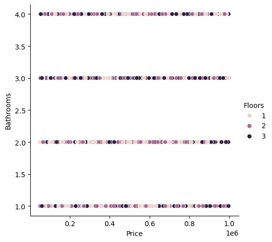

# 🏠 House Price Prediction - Exploratory Data Analysis (EDA)

## 📌 Project Overview

This project focuses on performing **Exploratory Data Analysis (EDA)** on a House Price dataset to understand the factors influencing housing prices. The analysis includes data inspection, statistical summaries, and visualization using Python.

---

## 📂 Dataset Description

The dataset consists of **2000 rows and 10 columns** representing various attributes of houses.

### 🔑 Features:

* **Id** – Unique identifier
* **Area** – Size of the house (in square feet)
* **Bedrooms** – Number of bedrooms
* **Bathrooms** – Number of bathrooms
* **Floors** – Number of floors
* **YearBuilt** – Construction year
* **Location** – Area type (Urban, Rural, Suburban, Downtown)
* **Condition** – Property condition (Excellent, Good, Fair, Poor)
* **Garage** – Availability of garage (Yes/No)
* **Price** – Target variable (house price)

---

## 📊 Data Analysis Process

### 1️⃣ Data Loading

The dataset is loaded using Pandas:

```python
data = pd.read_csv("House Price Prediction Dataset.csv")
```

---

### 2️⃣ Data Inspection

Basic checks performed:

* `data.head()` → First 5 rows
* `data.tail()` → Last 5 rows
* `data.columns` → Column names
* `data.shape` → Dataset dimensions

---

### 3️⃣ Statistical Summary

```python
data.describe()
```

Provides:

* Mean, median, standard deviation
* Minimum and maximum values

---

### 4️⃣ Missing Values Check

```python
data.isnull().sum()
```

✅ Result: No missing values found in the dataset.

---

## 📈 Data Visualization

### 🔹 Price vs Bathrooms (with Floors)

```python
sns.relplot(x='Price', y='Bathrooms', hue='Floors', data=data)
```


**Observation:**

* Weak relationship between price and bathrooms
* Floors do not significantly impact price

---

### 🔹 Price vs Year Built

```python
sns.relplot(x='Price', y='YearBuilt', data=data)
```


**Observation:**

* No clear trend between house age and price
* Prices are evenly distributed across years

---

### 🔹 Price vs Condition

```python
sns.relplot(x='Price', y='Condition', data=data)
```


**Observation:**

* All conditions have wide price ranges
* Slight tendency for higher prices in “Excellent” condition

---

## 🧠 Key Insights

* Dataset is clean and well-structured
* Price ranges from **50,000 to ~1,000,000**
* No strong linear relationships observed in basic plots
* Categorical variables (Location, Condition, Garage) need encoding

---

## 👤 Author

**Ranjan Singh**
